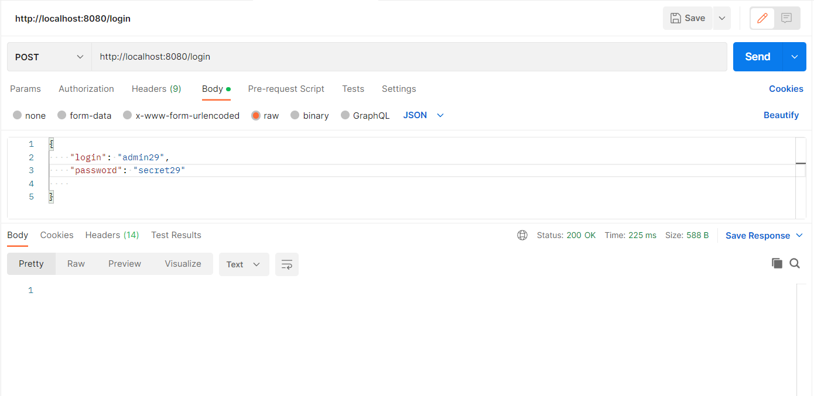

## Сервис auth

Простой проект авторизации, редактирования, удаления пользователей.
Построенный на  Rest архитектуре. С обработкой исключений, валидации полей.
Для авторизации использует Json Web Token.

### Стек технологий:

### Виды

#### Вид входа

#### Вид регистрации

#### Вид получения пользователя

#### Вид редактирования пользователя с ид

#### Вид редактирования пользователя без ид

#### Вид удаления пользователя

#### Вид валидации полей
